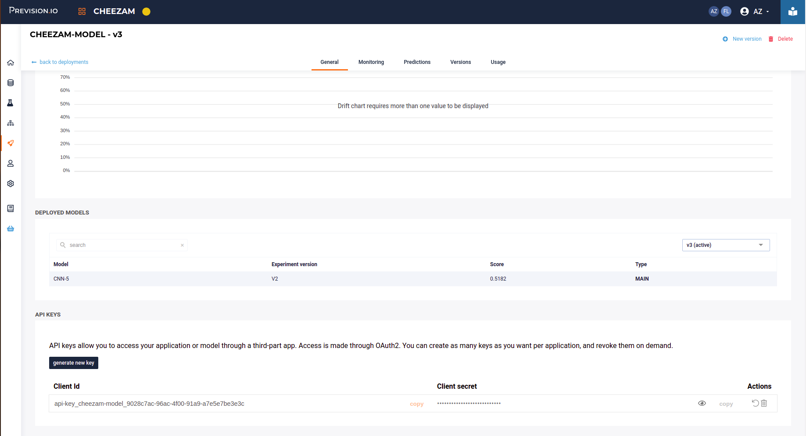
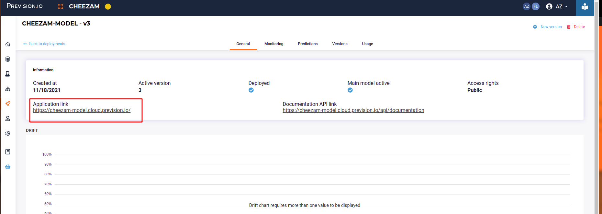
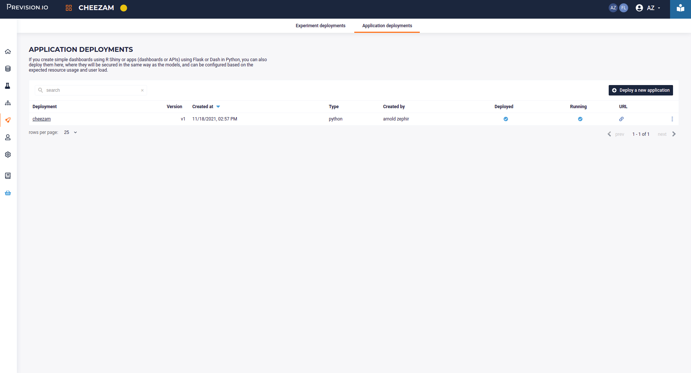
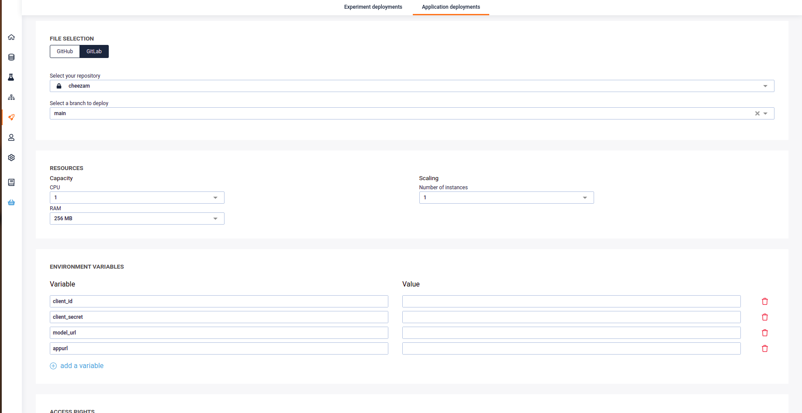

# Deploying an image detector app

## Pre-requiste

- An object detector model : This app only works with Object Detector models
- client id
- client secret
- model url
- optionnal : an app url, to generate doc
  
## Setup for Dev 

- fork this project and then clone
- fill the .env file ( see .env.example )
- Create a python virtual env and install ( we advise you t use python 3.8)


``` 
git clone git@github.com:previsionio/prevision-object-detector-app.git
cd prevision-object-detector-app.git
python3.8 -m venv env
pip install -r requirements.txt 

```

Then create a `.env` file from the `env.example` and fill it with the information from your model

```
client_id=<YOUR CLIENT ID>>
client_secret=<YOUR CLIENT_SECRET>
model_url=<YOUR_MODEL_URL>
appurl=<YOU_APP_URL>
```




( _You can fill the appurl env var to generate doc_ )

Then launch server using gunicorn

```
gunicorn --reload --bind 0.0.0.0:8080 --timeout 120  --limit-request-line 0   --access-logfile - run:app
```

Go to http://localhost:8080/ and check everything is fine. You should see a webapp.  You can test the API with the curl command (  using any image you want ):

```
curl --location --request POST 'http://localhost:8080/api/model/prediction' \
--form 'img=@"./test_img.jpg"'
```

If both the webapp and curl command are ok, you can proceed to customisation or deployment

## Customisation

Server is flask based with jinja as template engine. You can edit the `app/templates/base.html` to tweak your footer and header.

You can change the content of the `app/templates/about` page or add page to you project in the `run.py` file.

You can change colors and font in the `app/styles.css` file.


## Prod

If everything is fine  you can deploy to your account. Juste deploy a new app, do not forget to fill the env var with the content of your .env file.






